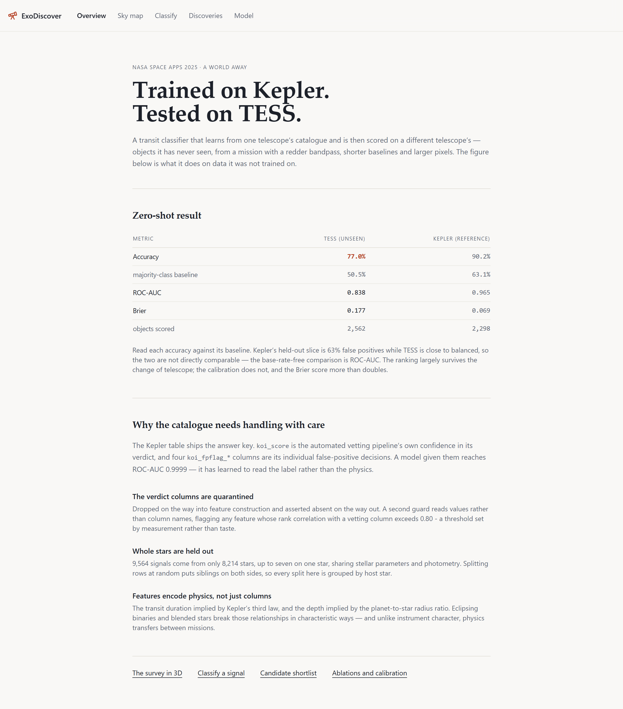
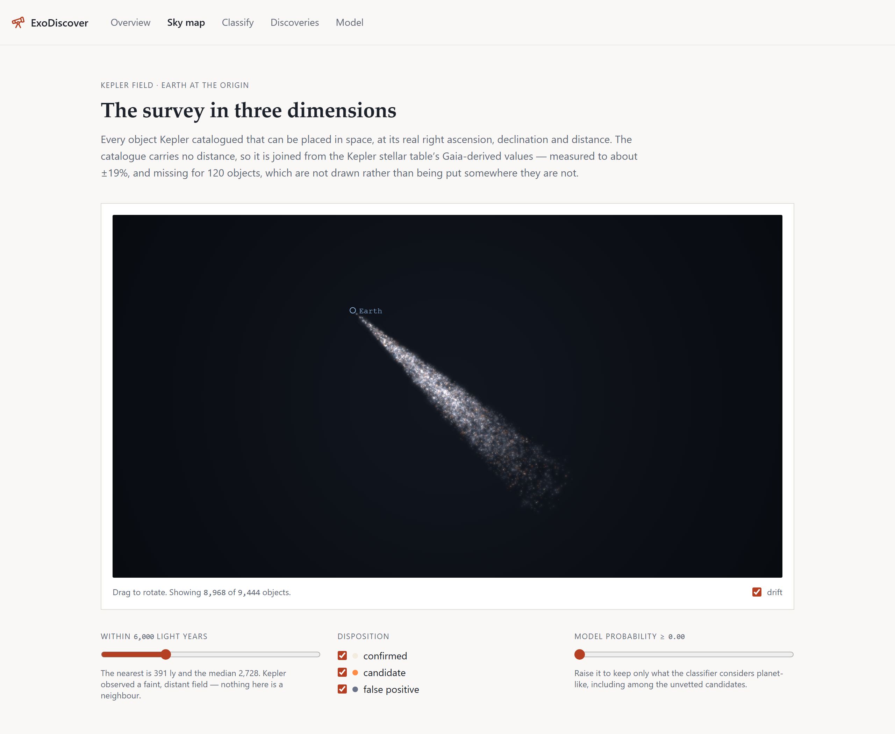
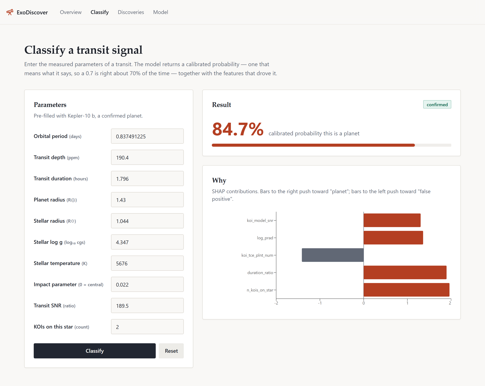
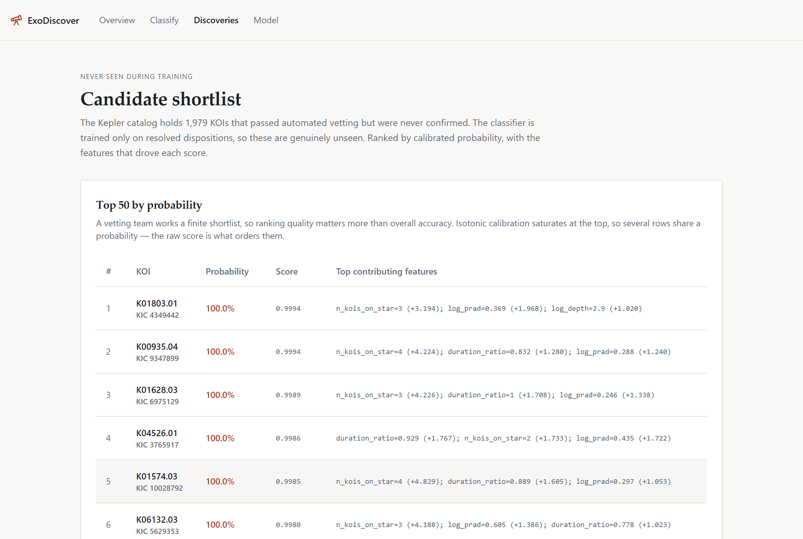
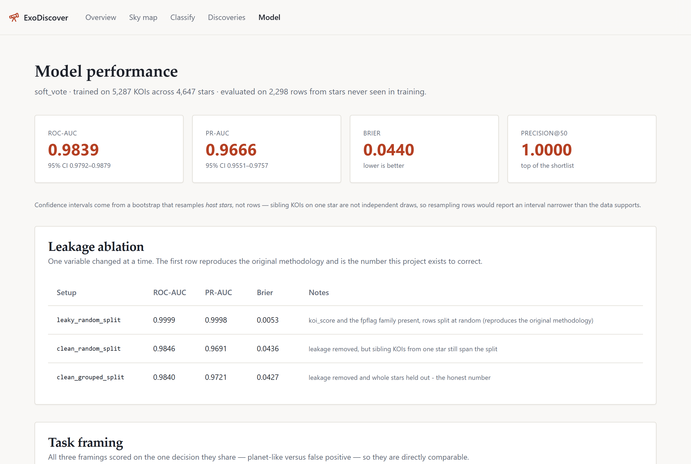

# ExoDiscover

Finding exoplanets in NASA's Kepler catalogue, and testing the result on TESS —
a telescope the model never trained on.

> **This is a rebuilt version of a NASA Space Apps 2025 hackathon submission**
> ([A World Away: Hunting for Exoplanets with
> AI](https://www.spaceappschallenge.org/2025/challenges/a-world-away-hunting-for-exoplanets-with-ai/)).
> The original reported a strong accuracy that turned out to be measuring the
> wrong thing: the Kepler table ships the vetting pipeline's own verdict as a
> column. This version quarantines those columns, holds out whole host stars
> rather than rows, and reports what the model does on a different mission's
> data. See [`docs/LEAKAGE.md`](docs/LEAKAGE.md) for the full investigation.

```
77% accuracy zero-shot on TESS      (majority-class baseline 51%)
ROC-AUC 0.838 · Brier 0.177 · n = 2,562 resolved TESS objects
```

---



Every catalogued object placed in real space, Earth at the origin — filterable by
distance, disposition and the model's own probability. The cone is the actual
survey: Kepler stared at one 22°×16° window, so the objects form a narrow beam
punched thousands of light years deep rather than a sphere of neighbours.



Classify a single transit signal and see the SHAP contributions behind the
probability:



The 1,979 unvetted Kepler candidates, ranked — none of them seen in training:



Ablations, calibration and the model ladder, all read live from the API:



---

## Run it

Everything runs on localhost. The trained model and its metrics are committed,
so **you do not need to download a catalogue or train anything.**

**Prerequisites:** Python 3.11 or 3.12, Node 20+.

```bash
make install     # pip install -e ".[dev,api]", then npm install in web/
```

Then, in two terminals:

```bash
make serve       # FastAPI on :8000  — interactive docs at /docs
make web         # React UI on :5173
```

Open <http://localhost:5173>.

Without `make` (Windows, or no GNU make installed):

```bash
pip install -e ".[dev,api]"
cd web && npm install && cd ..
uvicorn api.main:app --reload --port 8000     # terminal 1
cd web && npm run dev                         # terminal 2
```

Or run the whole stack with `docker compose up --build`.

### Regenerating the model

Only needed to reproduce the artifacts rather than use the committed ones:

```bash
exo ingest              # NASA archive -> data/raw/
exo train --trials 40   # ~25 min, CPU only  (exo train --fast, ~6 min)
```

### Checks

```bash
make test        # pytest (offline, against committed fixtures) + vitest
make lint        # ruff, mypy, eslint
```

## Layout

```
ml/exodiscover/    ingest · leakage firewall · physics features · training · evaluation
api/               FastAPI: typed prediction, batch CSV, SHAP, metrics
web/               React UI — every screen calls the API, no mock data
docs/              LEAKAGE.md · MODEL_CARD.md · metrics/
tests/             117 tests, offline against committed fixtures
```

**[`docs/LEAKAGE.md`](docs/LEAKAGE.md)** is the substance of the project.
**[`docs/MODEL_CARD.md`](docs/MODEL_CARD.md)** records intended use and limitations.

Python 3.11 · scikit-learn, CatBoost/XGBoost/LightGBM, Optuna, SHAP · FastAPI ·
React, TypeScript, Vite, Tailwind · pytest, vitest, ruff, mypy, GitHub Actions.
CPU only, start to finish.
